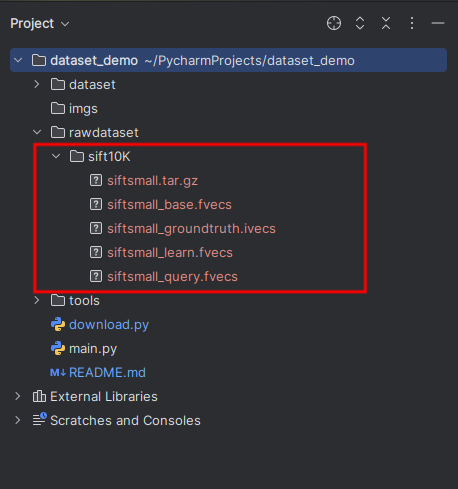
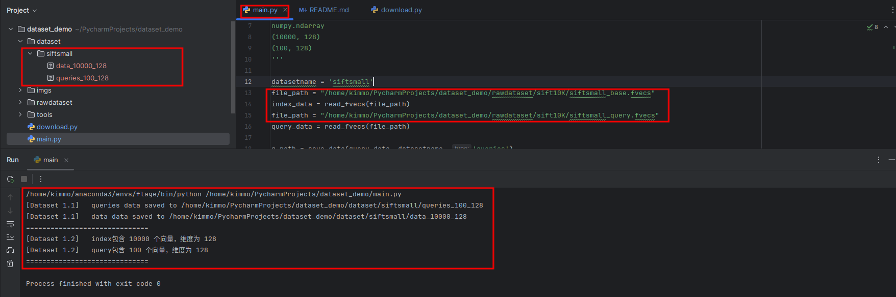
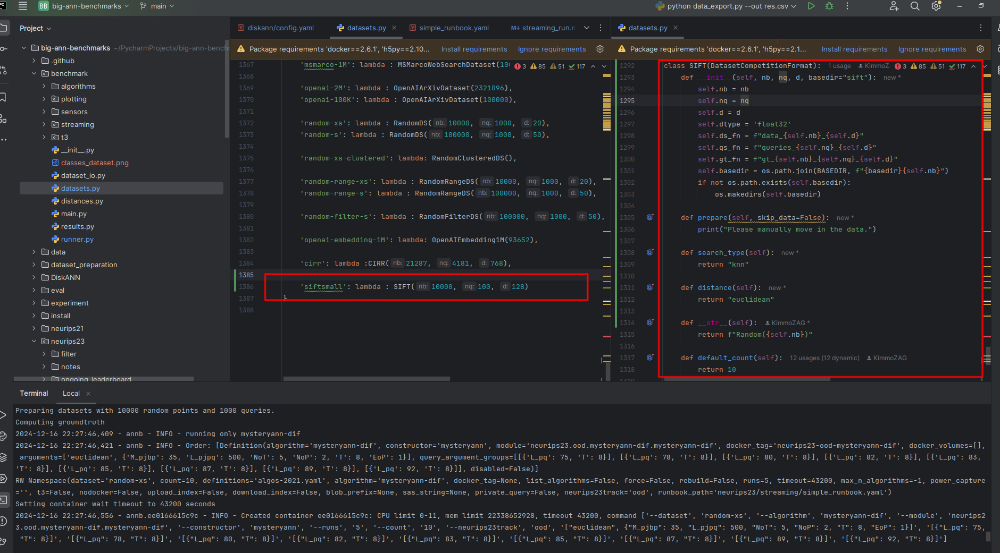
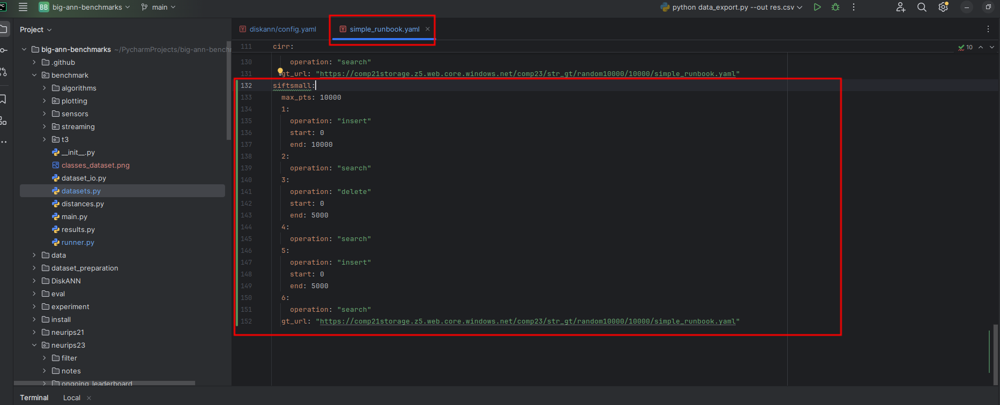
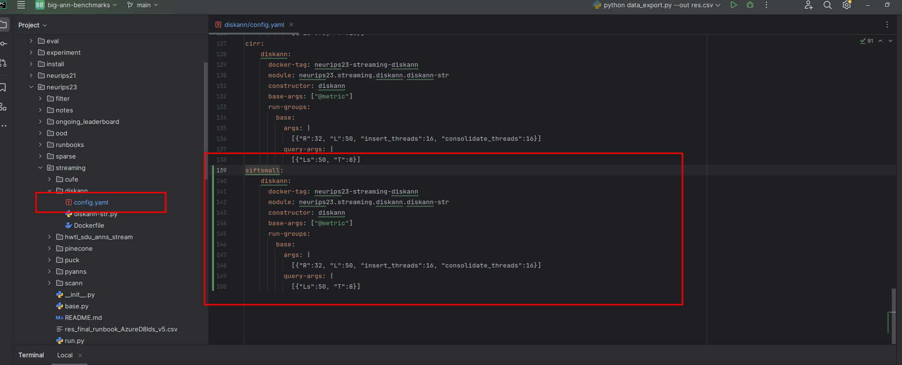
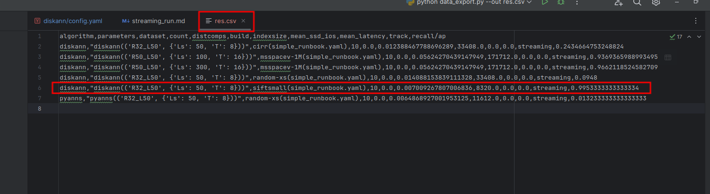

# How to prepare dataset for big-ann

以siftsmall为例，进行演示

## 1 First, you should prepare your raw dataset

首先下载好数据集，运行download.py文件，得到数据集，在rawdataset/sift10K下，我们需要用到的是用于构建索引的数据(index)以及查询数据(query)

``` python
python download.py 
```



随后运行main.py，得到可以用于big-ann的数据

``` python
python main.py
```



## 2 Second, you should prepare code for your dataset

首先，需要在big-ann的benchmark/datasets.py里添加对应的代码



其次，需要在neurips23/runbooks下编辑对应的runbook，以最简单的simple_runbook.yaml为例



随后，需要在对应的算法处进行修改，以diskann为例，修改neurips23/streaming/diskann/config.yaml



## 3 Second, test your dataset

假设已经安装了diskann的容器，运行以下代码

``` python
python create_dataset.py --dataset siftsmall
python run.py --neurips23track streaming --algorithm diskann --dataset siftsmall --runbook_path neurips23/runbooks/simple_runbook.yaml
python benchmark/streaming/compute_gt.py --dataset siftsmall --runbook neurips23/runbooks/simple_runbook.yaml --gt_cmdline_tool DiskANN/build/apps/utils/compute_groundtruth
sudo chmod 777 -R results/
python data_export.py --out res.csv
```

即可以看到结果

